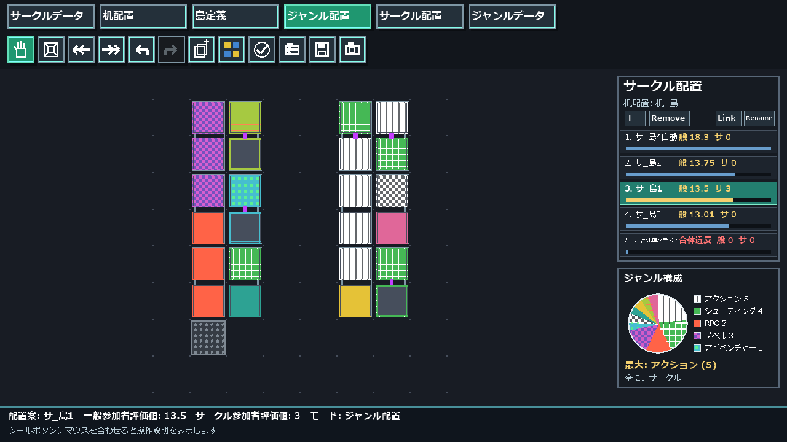

# Circle Space Coordinator

イベント会場の机・席・参加サークルを配置し、複数の配置案を編集・比較する Windows デスクトップアプリです。

（※画面は v1.1.0 開発中のものです）  

使い方・開発・過去版の資料は[文書の目次](Docs/README.md)からたどってください。

## ライセンス

[MIT License](LICENSE.txt)
